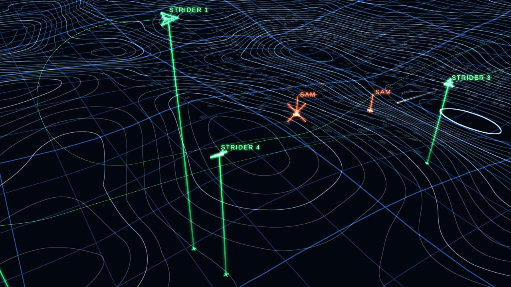

# Wireframe Skies — web wallpaper for Wallpaper Engine

**[▶ Live demo](https://wladbelsky.github.io/wireframe-skies/)** — runs in the browser (⚙ SETTINGS → demo beat, or play an audio file).
**[Steam Workshop](https://steamcommunity.com/sharedfiles/filedetails/?id=3815966692)** — subscribe in Wallpaper Engine.



A flight replay in the style of a mission-results screen: a dark void, a perspective grid and a wireframe map in
relief — coastlines, contour lines over hills and mountains, city blocks — and schematic, glowing symbols: the four-ship flight as green arrowheads with
their callsigns, altitude lines down to the ground and trails; ground units and ships as markers on the map with a pole
up to their name — green for the flight, blue for allies, red for the enemy. No result tables, no HUD: just the replay.

- **Without music** the flight (`STRIDER 1…4` by default) cruises across the map in formation, changing altitude and
  heading, switching formations (finger four, diamond, echelon, line abreast, trail) and now and then rolling or
  looping. The landscape changes as it flies: open sea, coasts, mountains, cities.
- **Allies** pass by: fleets (AEGIS, DESTROYER, now and then a CARRIER) at sea, armour columns (TANK, APC, SAM, HQ)
  on land, fighter pairs with their own callsigns, an AWACS high above. In a fight they fire at the enemy too.
- **With music** enemies appear ahead — fighters, bombers, attack jets and helicopters in the air, SAM sites, AA guns,
  tanks and radars on land, frigates and destroyers at sea. The flight breaks, picks targets, fires missiles on the
  beat (guns on the snare), then repositions with loops, Immelmanns, split-S, barrel rolls and break turns.
  When the music starts the flight first opens into a combat spread; it breaks only when the first contacts show on
  radar, toward them.
  It fights as two pairs: a wingman backs its lead up (the same tough target, or one next to it) and covers its six
  between attacks, damaged and long-ignored targets come first, and the next wave arrives once this one is under way.
  New targets appear like radar contacts: a ping, the pole rising from the ground, the name typing out.
  A destroyed target gets a red **X** and its name is struck through, then it fades away.
- **Enemies fire back** (red missiles from fighters, SAM sites and ships, AA streams from guns and ships), but never hit: the targeted plane breaks and pops flares.
- When the music stops the flight holds for a few seconds, then finishes off the targets still on screen (for up to
  14 s, without music); every other enemy retreats — aircraft turn away, ground units flicker out. Then the flight
  rejoins its formation.
- A short notification sound never starts a fight: the music has to play for 4 s.

## Install

Subscribe on the [Steam Workshop](https://steamcommunity.com/sharedfiles/filedetails/?id=3815966692), or in Wallpaper Engine
→ **Open from File** → `project.json` from this folder.

## Settings

| Property | |
|---|---|
| Camera | *Cinematic* (default): the camera cuts between shots — chase, rear quarter, side, high orbit, head-on, wide — and in combat follows one plane and its target. *Fixed*: one angle of your choice. |
| Camera zoom, % | closer / further |
| Shot length, s | how long the camera keeps one angle and, in combat, one plane (±20 %); the view always glides, never jumps |
| Camera direction / height | fixed camera: azimuth relative to the flight's heading (180 = behind) and elevation |
| Audio sensitivity, % | beat detection sensitivity |
| Enemy density, % | how many enemies a fight brings (0 = none, the flight just flies) |
| Enemies fire back | hostile missiles and AA fire (always missing) |
| Aerobatics | how often the flight shows off (0 = calm, also fewer maneuvers in combat) |
| Allied ships, ground units and aircraft | allies on the map (off: they fade away) |
| Flight / enemy / ally / grid & sea / coast, contour & city colour | the palette |
| Trail length, s | 0 = no trails |
| Altitude lines, Names | the vertical lines to the ground and the callsigns / target names |
| Squadron callsign | the planes are called `<callsign> 1…4` (letters, digits, spaces, up to 14 characters) |
| Flight speed, % | how fast everything moves |

## Browser preview

Serve the folder (e.g. `python -m http.server 8765`) and open `http://localhost:8765/`.
The **⚙ SETTINGS** drawer mirrors all Wallpaper Engine properties and adds a demo beat and an audio-file player
(the file is analysed the same way Wallpaper Engine analyses system audio). URL parameters: `?demo=1` (demo beat on),
`?cam=fixed`, `?zoom=150`, `?ts=4` (time ×4). On a phone in portrait the camera pulls back so the flight stays in frame.

## Tests

Playwright tests run headless in Docker (no local Node needed):

```
powershell -ExecutionPolicy Bypass -File tools/test.ps1
```

They boot the wallpaper with a seeded random generator and drive the simulation step by step: peace and combat
behaviour, invariants after every step (nobody hits the ground, enemies stand on the right terrain, bounded pools),
the ground shader against the JavaScript terrain, rendering, memory leaks over a 40-minute soak. GitHub Actions runs
the same suite on every push. Developer notes: [CLAUDE.md](CLAUDE.md).

---
Not affiliated with any game publisher; all callsigns and the look are generic.
